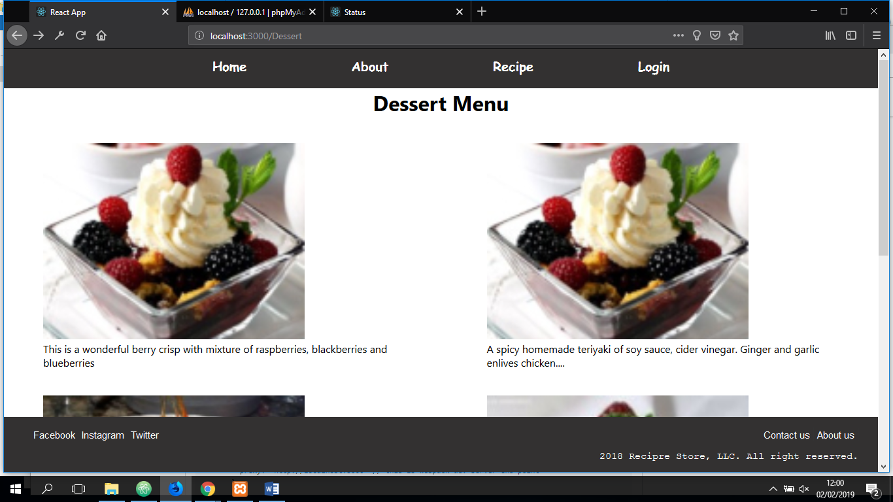
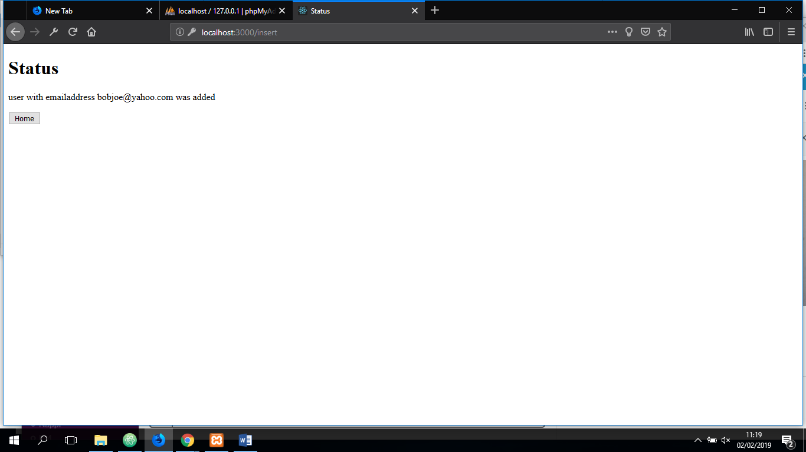
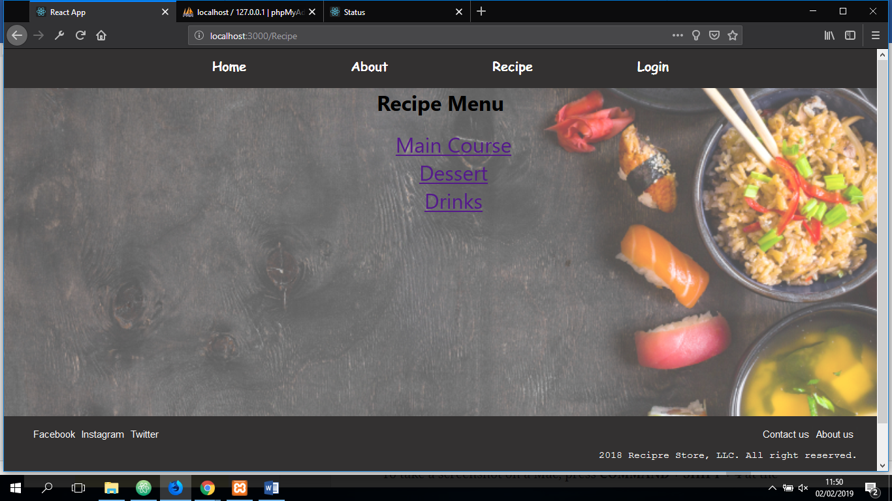
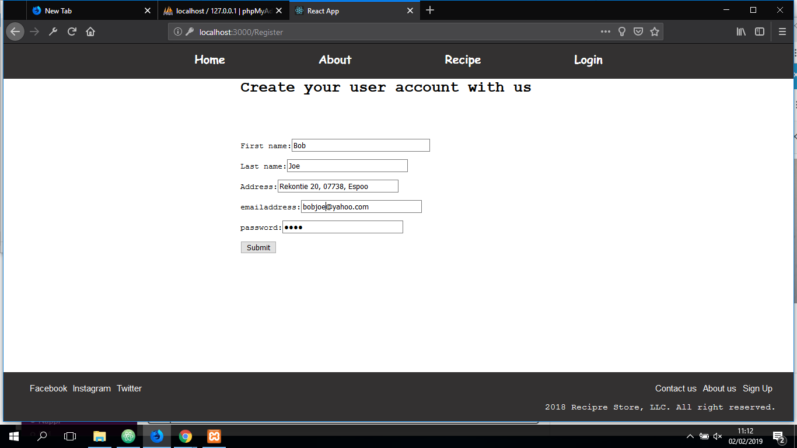
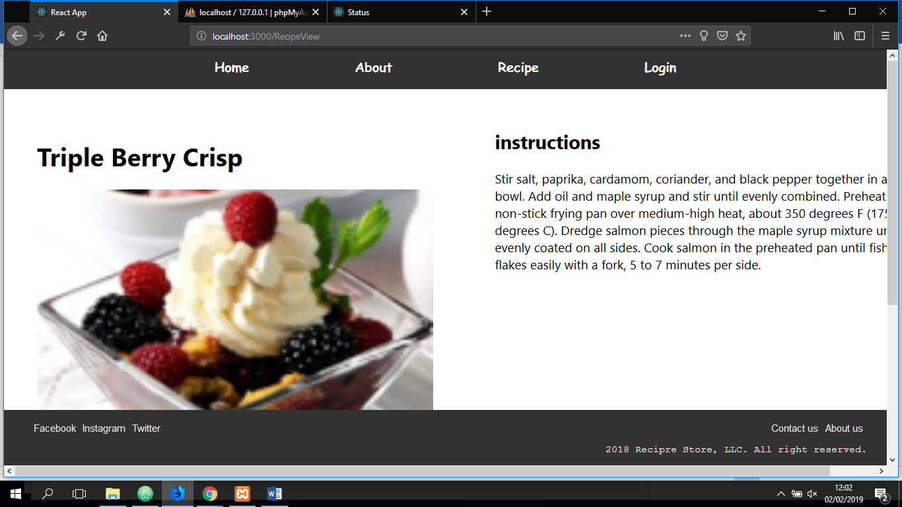

Start the project by creating the project app
At the commamd line
Type “npx create-react-app reactrecipe”

When the app is created

cd reactrecipe

Test if the app works

npm start

Upload project to github

add client database --- follow the step below

md clientDb

cd clientDb

npm init

npm install express // to use node express liabraries

configure the scripts in the packet.json and add:  
"start": "node ./clientDb/index.js|react-scripts start" // to be able to start database and the client side consecutively

run "npm start" to start the database and the client side consecutively

database connection is done by adding proxy connection in the package.json ("proxy": "http://localhost:8000")

User is able to access pages

User is able to create user account

The site provides recipe information to users

User is able to rate the recipe.

This shows dessert recipies

User successfully register to the database

User can navigate through to various recipies

User can register to the database

This shows dessert child recipe
